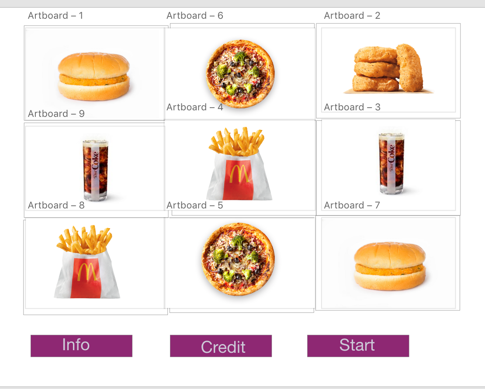

# Hungry-Hitz

#Wireframe 

Game Instruction:

## Game Instructions // Game Rules // etc. 
1. The user could add credit in the credit box by clicking the box

2. Then Start button gets enabled

3. Once the user click the start button,Symbol position chnages.If it aligns in the same raw or column credits are awarded

4. The player gets to play the game until user credit is zero.

5. The player loses if the game play amount  is lesser than the credit

6. If the gameplay amount is more than the credit player wons the game

## Schedule (Objectives/Goals)
### Wednesday
1. Wireframes
2. Pseudo code

### Thursday
1. placing symbols and asssigning values 

### Friday
1. JS

### Saturday
1. HTML/CSS

### Sunday
1. HTML/CS + JS

### Monday
1. Tweaks and advance HTML/CSS (animations)
